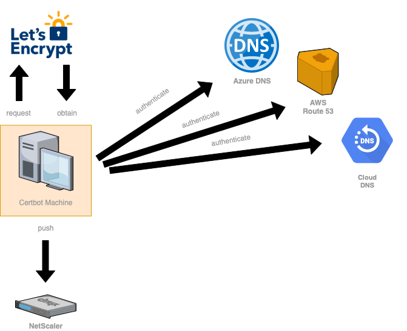

# netscaler-certbot-hook

This is a small script for installing and updating ssl certificates (e.g. from Letsencrypt) on a Citrix NetScaler.

Use it in combination with the DNS-01 challenge to fully automate the renewal process for your Letsencrypt certificates on your Citrix NetScaler ADC.

## Architecture



## Usage

```
-bash# python3 netscaler-certbot-hook.py 
usage: netscaler-certbot-hook.py [-h] --name <string> [--chain <string>]
                                 [--cert <file>] [--privkey <file>]
                                 [--chain-cert <file>]
netscaler-certbot-hook.py: error: the following arguments are required: --name
```

## Enroll an letsencrypt certificate via certbot

For example using Cloudflare DNS.
```
certbot --text --agree-tos --non-interactive certonly \
  --cert-name 'lauger.de' \
  -d 'lauger.de' \
  -d 'www.lauger.de' \
  -a dns-cloudflare \
  --dns-cloudflare-credentials /etc/letsencrypt/cloudflare.ini \
  --keep-until-expiring
```

## Run netscaler-certbot-hook

Set the required environment variables.

```
export NS_URL=https://192.168.10.10
export NS_LOGIN=nsroot
export NS_PASSWORD=nsroot
```

Run script and push certificate to your NetScaler.

```
python3 netscaler-certbot-hook.py --name lauger.de
```

By default, the script assumes your certificate in /etc/letsencrypt/live. If your certificate is stored somewhere else, just set `--cert`, `--privkey` and `--chain-cert` to your custom certificate path.

```
python3 netscaler-certbot-hook.py --name lauger.de \
  --cert /etc/letsencrypt/live/lauger.de/cert.pem \
  --privkey /etc/letsencrypt/live/lauger.de/privkey.pem \
  --chain-cert /etc/letsencrypt/live/lauger.de/chain.pem
```

## Example Output

### Inital setup

```
-bash# python3 netscaler-certbot-hook.py --name lauger.de
chain certificate letsencrypt not found
uploading chain certificate as letsencrypt-1581896753.crt
installing chain certificate with serial 13298795840390663119752826058995181320
certificate lauger.de not found
uploading certificate as lauger.de-1581896753.crt
uploading private key as lauger.de-1581896753.key
installing certificate with serial 409596789458967997345847308430335698529007
```

### Update check

```
-bash# python3 netscaler-certbot-hook.py --name lauger.de
chain certificate letsencrypt found with serial 13298795840390663119752826058995181320
installed chain certificate matches our serial - nothing to do
certificate lauger.de found with serial 409596789458967997345847308430335698529007
installed certificate matches our serial - nothing to do
```

## Authors

- [slauger](https://github.com/slauger)
